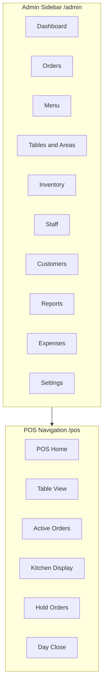

# Menus & Navigation

This document defines the navigation structure for the Restaurant Management System across **Admin**, **POS**, and **API** surfaces. It is the single source of truth for menu items, routes, role access, and implementation phase.

Related documents:

- [prd-restaurant-management-system.md](prd-restaurant-management-system.md) — product requirements and schemas
- [docs/api.md](../docs/api.md) — API endpoint reference

---

## Architecture Overview



---

## Admin Sidebar (`/admin/*`)

**Blade file (to be created):** `resources/views/restaurant/admin/elements/sidebar.blade.php`

Pattern follows event-management-web: `resources/views/admin/elements/sidebar.blade.php`.

### Menu Tree

```mermaid
flowchart TD
    Root[Admin Panel]

    Root --> Dashboard["Dashboard /admin"]
    Root --> OrdersMenu[Orders]
    Root --> MenuMenu[Menu]
    Root --> TablesMenu["Tables and Areas"]
    Root --> InventoryMenu[Inventory]
    Root --> StaffMenu[Staff]
    Root --> CustomersMenu[Customers]
    Root --> ReportsMenu[Reports]
    Root --> ExpensesMenu[Expenses]
    Root --> SettingsMenu[Settings]

    OrdersMenu --> LiveOrders["Live Orders /admin/orders"]
    OrdersMenu --> OrderHistory["Order History /admin/orders/history"]
    OrdersMenu --> VoidLog["Void and Cancel Log /admin/orders/void-log"]

    MenuMenu --> Categories["Categories /admin/menu/categories"]
    MenuMenu --> Items["Items /admin/menu/items"]
    MenuMenu --> Variants["Variants /admin/menu/variants"]
    MenuMenu --> Addons["Add-ons /admin/menu/addons"]
    MenuMenu --> Combos["Combos /admin/menu/combos"]

    TablesMenu --> Areas["Areas /admin/tables/areas"]
    TablesMenu --> TablesList["Tables /admin/tables"]
    TablesMenu --> Layout["Table Layout /admin/tables/layout"]

    InventoryMenu --> RawMaterials["Raw Materials /admin/inventory/materials"]
    InventoryMenu --> Recipes["Recipes /admin/inventory/recipes"]
    InventoryMenu --> PurchaseOrders["Purchase Orders /admin/inventory/purchase-orders"]
    InventoryMenu --> Suppliers["Suppliers /admin/inventory/suppliers"]
    InventoryMenu --> StockAlerts["Stock Alerts /admin/inventory/alerts"]

    StaffMenu --> Employees["Employees /admin/staff"]
    StaffMenu --> Roles["Roles and Permissions /admin/staff/roles"]

    CustomersMenu --> CustomerList["Customer List /admin/customers"]
    CustomersMenu --> Loyalty["Loyalty /admin/customers/loyalty"]

    ReportsMenu --> SalesReport["Sales /admin/reports/sales"]
    ReportsMenu --> ItemReport["Item-wise /admin/reports/items"]
    ReportsMenu --> TaxReport["Tax and GST /admin/reports/tax"]
    ReportsMenu --> StaffReport["Staff /admin/reports/staff"]
    ReportsMenu --> InventoryReport["Inventory /admin/reports/inventory"]

    ExpensesMenu --> ExpenseList["Expense List /admin/expenses"]
    ExpensesMenu --> ExpenseCategories["Categories /admin/expenses/categories"]

    SettingsMenu --> Profile["Restaurant Profile /admin/settings/profile"]
    SettingsMenu --> TaxSettings["Tax Settings /admin/settings/tax"]
    SettingsMenu --> Payments["Payment Methods /admin/settings/payments"]
    SettingsMenu --> Printers["Printers /admin/settings/printers"]
    SettingsMenu --> Outlets["Outlets /admin/settings/outlets"]
```



### Admin Menu Table

| Menu Item | Sub-items | Route | Route name (suggested) | Roles | Phase |
|-----------|-----------|-------|------------------------|-------|-------|
| Dashboard | — | `/admin` | `admin.dashboard` | Owner, Manager, Cashier, Waiter, Kitchen | 1 |
| Orders | Live orders | `/admin/orders` | `admin.orders.index` | Owner, Manager, Cashier | 1 |
| Orders | Order history | `/admin/orders/history` | `admin.orders.history` | Owner, Manager, Cashier | 1 |
| Orders | Void/cancel log | `/admin/orders/void-log` | `admin.orders.void-log` | Owner, Manager | 1 |
| Menu | Categories | `/admin/menu/categories` | `admin.menu.categories.index` | Owner, Manager | 1 |
| Menu | Items | `/admin/menu/items` | `admin.menu.items.index` | Owner, Manager | 1 |
| Menu | Variants | `/admin/menu/variants` | `admin.menu.variants.index` | Owner, Manager | 1 |
| Menu | Add-ons | `/admin/menu/addons` | `admin.menu.addons.index` | Owner, Manager | 1 |
| Menu | Combos | `/admin/menu/combos` | `admin.menu.combos.index` | Owner, Manager | 1 |
| Tables & Areas | Areas | `/admin/tables/areas` | `admin.tables.areas.index` | Owner, Manager | 1 |
| Tables & Areas | Tables | `/admin/tables` | `admin.tables.index` | Owner, Manager | 1 |
| Tables & Areas | Table layout | `/admin/tables/layout` | `admin.tables.layout` | Owner, Manager | 1 |
| Inventory | Raw materials | `/admin/inventory/materials` | `admin.inventory.materials.index` | Owner, Manager | 2 |
| Inventory | Recipes | `/admin/inventory/recipes` | `admin.inventory.recipes.index` | Owner, Manager | 2 |
| Inventory | Purchase orders | `/admin/inventory/purchase-orders` | `admin.inventory.purchase-orders.index` | Owner, Manager | 2 |
| Inventory | Suppliers | `/admin/inventory/suppliers` | `admin.inventory.suppliers.index` | Owner, Manager | 2 |
| Inventory | Stock alerts | `/admin/inventory/alerts` | `admin.inventory.alerts` | Owner, Manager | 2 |
| Staff | Employees | `/admin/staff` | `admin.staff.index` | Owner, Manager | 2 |
| Staff | Roles & permissions | `/admin/staff/roles` | `admin.staff.roles.index` | Owner | 2 |
| Customers | Customer list | `/admin/customers` | `admin.customers.index` | Owner, Manager | 2 |
| Customers | Loyalty | `/admin/customers/loyalty` | `admin.customers.loyalty` | Owner, Manager | 3 |
| Reports | Sales | `/admin/reports/sales` | `admin.reports.sales` | Owner, Manager | 2 |
| Reports | Item-wise | `/admin/reports/items` | `admin.reports.items` | Owner, Manager | 2 |
| Reports | Tax/GST | `/admin/reports/tax` | `admin.reports.tax` | Owner, Manager | 2 |
| Reports | Staff | `/admin/reports/staff` | `admin.reports.staff` | Owner, Manager | 2 |
| Reports | Inventory | `/admin/reports/inventory` | `admin.reports.inventory` | Owner, Manager | 2 |
| Expenses | Expense list | `/admin/expenses` | `admin.expenses.index` | Owner, Manager | 2 |
| Expenses | Categories | `/admin/expenses/categories` | `admin.expenses.categories.index` | Owner, Manager | 2 |
| Settings | Restaurant profile | `/admin/settings/profile` | `admin.settings.profile` | Owner | 1 |
| Settings | Tax settings | `/admin/settings/tax` | `admin.settings.tax` | Owner | 1 |
| Settings | Payment methods | `/admin/settings/payments` | `admin.settings.payments` | Owner, Manager | 1 |
| Settings | Printers | `/admin/settings/printers` | `admin.settings.printers` | Owner, Manager | 1 |
| Settings | Outlets | `/admin/settings/outlets` | `admin.settings.outlets` | Owner | 3 |

### Admin Web Routes (Full List)

#### Phase 1

```
GET    /admin                              - Dashboard
GET    /admin/orders                       - Live orders list
GET    /admin/orders/history               - Order history
GET    /admin/orders/void-log              - Void/cancel audit log
GET    /admin/orders/{id}                    - Order detail
POST   /admin/orders/{id}/void             - Void order (manager+)

GET    /admin/menu/categories              - List categories
POST   /admin/menu/categories              - Create category
GET    /admin/menu/categories/{id}/edit      - Edit category form
PUT    /admin/menu/categories/{id}         - Update category
DELETE /admin/menu/categories/{id}         - Delete category

GET    /admin/menu/items                   - List items
POST   /admin/menu/items                   - Create item
GET    /admin/menu/items/{id}/edit         - Edit item form
PUT    /admin/menu/items/{id}              - Update item
DELETE /admin/menu/items/{id}              - Delete item
PATCH  /admin/menu/items/{id}/availability - Toggle availability

GET    /admin/menu/variants                - List variants
GET    /admin/menu/addons                  - List add-ons
GET    /admin/menu/combos                  - List combos

GET    /admin/tables/areas                 - List areas
POST   /admin/tables/areas                 - Create area
PUT    /admin/tables/areas/{id}            - Update area
DELETE /admin/tables/areas/{id}            - Delete area

GET    /admin/tables                       - List tables
POST   /admin/tables                       - Create table
PUT    /admin/tables/{id}                  - Update table
DELETE /admin/tables/{id}                  - Delete table
GET    /admin/tables/layout                - Visual table layout

GET    /admin/settings/profile             - Restaurant profile form
PUT    /admin/settings/profile             - Update profile
GET    /admin/settings/tax                 - Tax settings
PUT    /admin/settings/tax                 - Update tax
GET    /admin/settings/payments            - Payment methods
PUT    /admin/settings/payments            - Update payment methods
GET    /admin/settings/printers            - Printer configuration
PUT    /admin/settings/printers            - Update printers
```

#### Phase 2

```
GET    /admin/inventory/materials          - Raw materials list
POST   /admin/inventory/materials          - Create material
PUT    /admin/inventory/materials/{id}     - Update material

GET    /admin/inventory/recipes            - Recipe list
POST   /admin/inventory/recipes            - Create recipe

GET    /admin/inventory/purchase-orders    - PO list
POST   /admin/inventory/purchase-orders    - Create PO
POST   /admin/inventory/purchase-orders/{id}/receive - Receive stock

GET    /admin/inventory/suppliers          - Supplier list
GET    /admin/inventory/alerts             - Low stock alerts

GET    /admin/staff                        - Staff list
POST   /admin/staff                        - Create staff
PUT    /admin/staff/{id}                   - Update staff
GET    /admin/staff/roles                  - Roles & permissions

GET    /admin/customers                    - Customer list
GET    /admin/customers/{id}               - Customer detail

GET    /admin/reports/sales                - Sales report
GET    /admin/reports/items                - Item-wise report
GET    /admin/reports/tax                  - Tax report
GET    /admin/reports/staff                - Staff report
GET    /admin/reports/inventory            - Inventory report
GET    /admin/reports/export               - CSV export

GET    /admin/expenses                     - Expense list
POST   /admin/expenses                     - Create expense
PUT    /admin/expenses/{id}                - Update expense
DELETE /admin/expenses/{id}                - Delete expense
GET    /admin/expenses/categories          - Expense categories
POST   /admin/expenses/categories          - Create category
```

#### Phase 3

```
GET    /admin/settings/outlets             - Outlet list
POST   /admin/settings/outlets             - Create outlet
GET    /admin/customers/loyalty            - Loyalty program settings
GET    /admin/online-orders                - Online / aggregator order inbox
```

---

## POS Navigation (`/pos/*`)

**Blade layout (to be created):** `resources/views/restaurant/pos/layouts/app.blade.php`

POS uses a simplified top/side navigation optimized for touch screens and fast order entry.

### POS Menu Table

| Screen | Route | Route name (suggested) | Roles | Phase | Description |
|--------|-------|------------------------|-------|-------|-------------|
| POS Home / New order | `/pos` | `pos.dashboard` | Cashier, Waiter, Manager, Owner | 1 | Start new order or resume |
| Table view | `/pos/tables` | `pos.tables.index` | Cashier, Waiter, Manager | 1 | Area/table grid with status |
| Active orders | `/pos/orders` | `pos.orders.index` | Cashier, Waiter, Manager | 1 | In-progress orders list |
| Order detail / Billing | `/pos/orders/{id}` | `pos.orders.show` | Cashier, Waiter, Manager | 1 | Add items, KOT, bill, pay |
| Kitchen display (KOT) | `/pos/kitchen` | `pos.kitchen.index` | Kitchen, Manager | 1 | Pending KOTs by station |
| Hold / parked orders | `/pos/hold` | `pos.hold.index` | Cashier, Waiter, Manager | 1 | Paused orders |
| Day close / settlement | `/pos/day-close` | `pos.day-close.index` | Cashier, Manager, Owner | 2 | End-of-day reconciliation |

### POS Web Routes (Full List)

#### Phase 1

```
GET    /pos                                - POS home
GET    /pos/tables                         - Table view
GET    /pos/orders                         - Active orders
GET    /pos/orders/create                  - New order form
POST   /pos/orders                         - Create order
GET    /pos/orders/{id}                    - Order detail / billing screen
PUT    /pos/orders/{id}                    - Update order (customer, table, notes)
POST   /pos/orders/{id}/items              - Add item to order
PUT    /pos/orders/{id}/items/{itemId}     - Update item quantity
DELETE /pos/orders/{id}/items/{itemId}     - Remove item
POST   /pos/orders/{id}/send-kot           - Send items to kitchen
POST   /pos/orders/{id}/hold               - Park/hold order
POST   /pos/orders/{id}/resume             - Resume held order
POST   /pos/orders/{id}/payments           - Record payment
POST   /pos/orders/{id}/void               - Void order (manager+)
GET    /pos/kitchen                        - Kitchen display
PATCH  /pos/kitchen/kots/{id}              - Update KOT status
GET    /pos/hold                           - Held orders list
```

#### Phase 2

```
GET    /pos/day-close                      - Day close screen
POST   /pos/day-close                      - Submit day close
GET    /pos/day-close/{id}                 - Day close detail
```

---

## Role-Based Access Matrix

Legend: **R** = Read, **W** = Read + Write, **—** = No access

### Admin Module Access

| Module / Menu | Owner | Manager | Cashier | Waiter | Kitchen |
|---------------|-------|---------|---------|--------|---------|
| Dashboard | R | R | R | R | R |
| Orders — Live | W | W | W | R | — |
| Orders — History | R | R | R | — | — |
| Orders — Void log | R | R | — | — | — |
| Orders — Void action | W | W | — | — | — |
| Menu — Categories | W | W | — | — | — |
| Menu — Items | W | W | — | — | — |
| Menu — Variants/Add-ons/Combos | W | W | — | — | — |
| Tables & Areas | W | W | — | R | — |
| Inventory | W | W | — | — | — |
| Staff — Employees | W | W | — | — | — |
| Staff — Roles | W | — | — | — | — |
| Customers | W | W | — | — | — |
| Reports | R | R | — | — | — |
| Expenses | W | W | — | — | — |
| Settings — Profile/Tax | W | — | — | — | — |
| Settings — Payments/Printers | W | W | — | — | — |
| Settings — Outlets | W | — | — | — | — |

### POS Module Access

| Screen | Owner | Manager | Cashier | Waiter | Kitchen |
|--------|-------|---------|---------|--------|---------|
| POS Home | W | W | W | W | — |
| Table view | W | W | W | W | — |
| Create/edit orders | W | W | W | W | — |
| Send KOT | W | W | W | W | — |
| Record payments | W | W | W | — | — |
| Void orders | W | W | — | — | — |
| Kitchen display | R | R | — | — | W |
| Update KOT status | W | W | — | — | W |
| Hold/resume orders | W | W | W | W | — |
| Day close | W | W | W | — | — |

---

## API Navigation (Logical Grouping)

API endpoints are not rendered in a sidebar but are grouped by domain for mobile/tablet clients. Full specification: [docs/api.md](../docs/api.md).

| API Group | Prefix | Clients | Phase |
|-----------|--------|---------|-------|
| Auth | `/api/v1/auth` | All apps | 1 |
| Menu | `/api/v1/menu` | POS, Captain app | 1 |
| Orders | `/api/v1/orders` | POS, Captain app | 1 |
| Tables | `/api/v1/tables` | POS, Captain app | 1 |
| KOT | `/api/v1/kot` | Kitchen display app | 1 |
| POS | `/api/v1/pos` | POS terminal | 1–2 |
| Inventory | `/api/v1/inventory` | Manager tablet | 2 |
| Customers | `/api/v1/customers` | Admin mobile | 2 |
| Reports | `/api/v1/reports` | Owner/Manager app | 2 |
| Online | `/api/v1/online` | Customer app / website | 3 |

---

## Sidebar Implementation Notes

### Admin Sidebar Blade

Create `resources/views/restaurant/admin/elements/sidebar.blade.php` with:

1. **Active state** — highlight current route using `request()->routeIs('admin.*')`
2. **Role gates** — wrap menu items in `@can` / `@role` directives
3. **Phase badges** — during development, optionally show Phase 2/3 items as disabled with tooltip
4. **Submenu collapse** — Menu, Orders, Tables, Inventory, Reports, Settings use expandable submenus
5. **Icons** — use GetSkills theme icon set (Flaticon / Font Awesome as per theme)

Example structure:

```blade
<li class="{{ request()->routeIs('admin.menu.*') ? 'mm-active' : '' }}">
    <a class="has-arrow" href="javascript:void(0);">
        <i class="flaticon-381-layer-1"></i>
        <span class="nav-text">Menu</span>
    </a>
    <ul aria-expanded="false">
        @can('menu.read')
        <li><a href="{{ route('admin.menu.categories.index') }}">Categories</a></li>
        <li><a href="{{ route('admin.menu.items.index') }}">Items</a></li>
        @endcan
    </ul>
</li>
```

### POS Navigation

POS uses a **horizontal tab bar** or **bottom nav** (tablet-friendly) rather than a full sidebar:

- **Orders** | **Tables** | **Kitchen** | **Hold** | **Day Close** (Phase 2)

Kitchen role users see only the Kitchen display screen after login.

### Login Redirect by Role

| Role | Default redirect after login |
|------|------------------------------|
| Owner, Manager, Cashier | `/pos` (or `/admin` if preference set) |
| Waiter | `/pos/tables` |
| Kitchen | `/pos/kitchen` |

---

## Theme Reference Pages

Existing GetSkills demo pages in `resources/views/getskills/` can inform UI patterns:

| RMS feature | Theme reference route |
|-------------|----------------------|
| Menu item grid | `/ecom-product-grid`, `/ecom-product-list` |
| Order checkout | `/ecom-checkout` |
| Invoice / bill | `/ecom-invoice` |
| Customer list | `/ecom-customers` |
| Data tables | `/table-datatable-basic` |
| Dashboard widgets | `/`, `/index-2` |
| Forms | `/form-validation`, `/form-element` |

---

**Document Version:** 1.0  
**Last Updated:** July 2026  
**Status:** Active — specification for implementation
